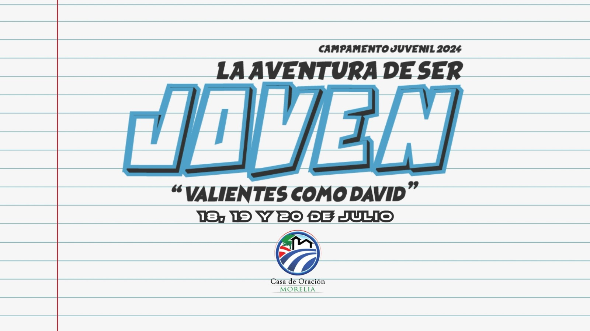

# Alabanzas_CDO_Morelia
## Letras y acordes de campamento 2024.

Cantos:

# Por favor escuchen los audios, aquí les dejo los links 

[Llueve](https://www.youtube.com/watch?v=yEbFndiPSGc&ab_channel=PROFETAYSALMISTA)

[Quien cambie la historia](https://www.youtube.com/watch?v=jM8M_xgKbrc&ab_channel=JoseAngel187)
[Tu eres mi Rey](https://www.youtube.com/watch?v=84E4Rjzu6PI&ab_channel=AudioAdrenaline-Topic)

[Cantaré](https://www.youtube.com/watch?v=piFrvBKfCx0&ab_channel=ChristianMusicPlaylist)

[Mi esperanza eres Tú](https://www.youtube.com/watch?v=y6TJ8UdOsGM&ab_channel=ThirdDay-Topic)

[Dios de avivamiento](https://www.youtube.com/watch?v=VgDOtJPWmFw&ab_channel=3rdDayRocker)

[Tus palabras](https://www.youtube.com/watch?v=KqaA8XBI15o&ab_channel=ThirdDayVEVO)

[La batalla](https://www.youtube.com/watch?v=3QaTaKJcodU&ab_channel=PhilWickham)

[Inunda](https://www.youtube.com/watch?v=eEBQ0HDvi7w&ab_channel=Visi%C3%B3nJuvenil-Topic)

Los cantos se pueden descargar en formato PDF y también se pueden descargar en formato docx para modificarlos 
de ser necesario. 

